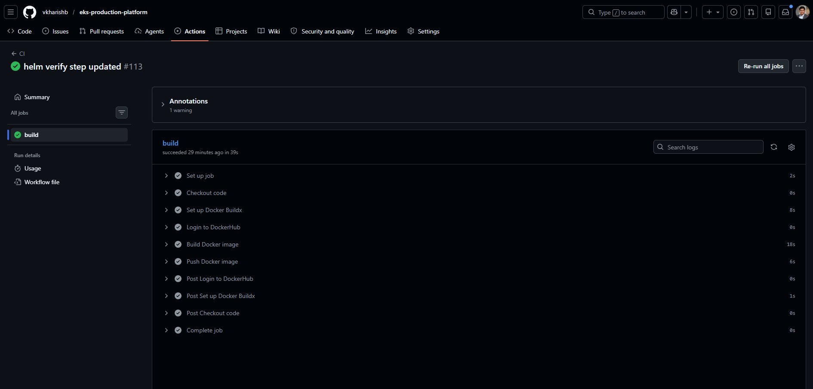
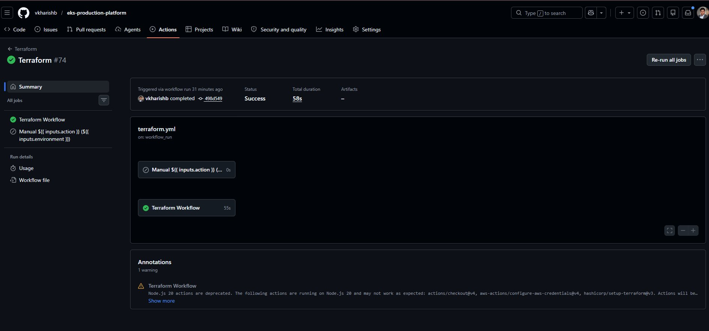
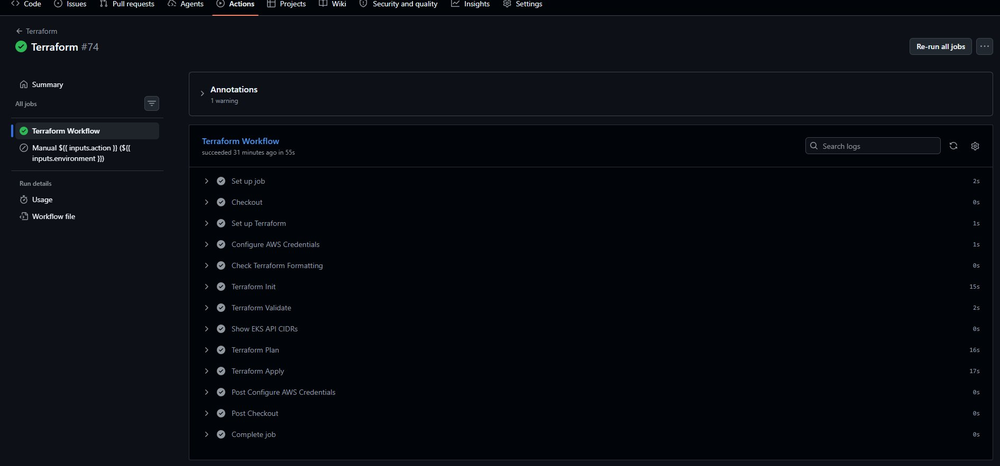
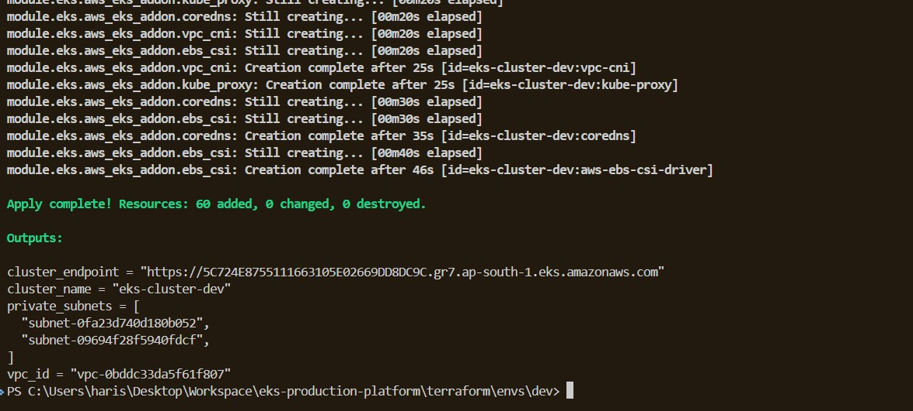
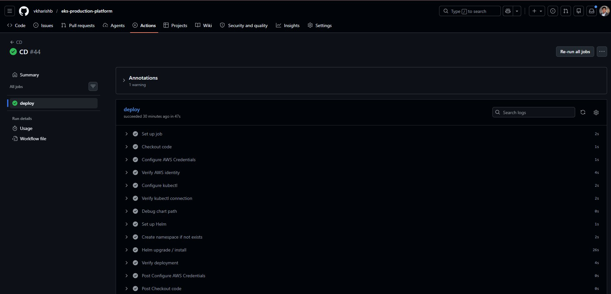

# EKS Production Platform

A production-grade AWS EKS platform built end-to-end with Terraform, Helm, and GitHub Actions. Infrastructure is provisioned automatically, applications are deployed atomically, and every pipeline stage is verified against a live AWS environment.

---

## ✅ Pipeline Proof — Live Runs

All three pipeline stages have been executed successfully against a real AWS environment. Click each link to view the full run logs.

| Stage | Status | Run Link |
|---|---|---|
| **CI** — Build & push Docker image | ✅ Passed | [View CI run →](https://github.com/vkharishb/eks-production-platform/actions/runs/26323786289) |
| **Terraform** — Provision EKS infrastructure | ✅ Passed | [View Terraform run →](https://github.com/vkharishb/eks-production-platform/actions/runs/26323802184) |
| **CD** — Helm deploy to EKS | ✅ Passed | [View CD run →](https://github.com/vkharishb/eks-production-platform/actions/runs/26323820158) |

> These are real GitHub Actions runs, not mocked output. The Terraform run provisioned an EKS cluster in `ap-south-1`; the CD run deployed the `hello-app` Helm release to the `production` namespace on that cluster.

---

## Repository Structure

```
.
├── .github/workflows/
│   ├── ci.yml              # Build Docker image and push to DockerHub
│   ├── terraform.yml       # Provision AWS infrastructure (auto after CI, or manual)
│   └── cd.yml              # Deploy hello-app to EKS via Helm
│
├── terraform/
│   ├── global/s3-backend/  # Bootstrap: S3 state bucket + DynamoDB lock table
│   ├── modules/
│   │   └── eks/            # EKS cluster, node group, managed add-ons, IRSA
│   └── envs/
│       ├── dev/            # Dev environment Terraform root
│       └── prod/           # Prod environment Terraform root
│
├── helm/
│   └── apps/hello-app/     # Application Helm chart (Deployment, Service, Ingress, HPA)
│
├── k8s/                    # Platform manifests
│   ├── namespaces/         # dev and prod namespaces
│   ├── network/            # NetworkPolicies (default-deny + allow-internal)
│   ├── quotas/             # ResourceQuotas per environment
│   ├── limits/             # LimitRanges per environment
│   ├── rbac/               # Roles and RoleBindings
│   └── storage/            # StorageClass definition
│
└── docker/
    ├── Dockerfile          # Minimal Go HTTP echo server image
    └── hello-server.go     # Echo server source
```

---

## Architecture

```
AWS ap-south-1
│
└── VPC 10.0.0.0/16
    ├── Public subnets
    │   ├── NAT Gateway
    │   └── Internet-facing ALB  (AWS Load Balancer Controller via IRSA)
    │
    └── Private subnets
        └── EKS Managed Node Group
            └── hello-app pods (Deployment + HPA)

EKS Cluster
├── Kubernetes 1.32
├── Managed add-ons: VPC CNI · CoreDNS · kube-proxy · EBS CSI
└── IRSA roles:  EBS CSI Driver · AWS Load Balancer Controller

Terraform State Backend
├── S3 bucket  (versioned, per-environment prefix)
└── DynamoDB   (state lock table)

CI/CD (GitHub Actions)
  CI ──► Terraform ──► CD
  (push to dev triggers full chain automatically)
```

---

## Environments

| Setting | Dev | Prod |
|---|---|---|
| NAT Gateways | 1 shared | 1 per AZ |
| EKS nodes | min 1 / desired 1 / max 3 | min 2 / desired 3 / max 6 |
| App replicas | 1 | 3 |
| HPA | Disabled | Enabled (3–10 replicas) |
| Ingress hostname | `hello-dev.internal` | `hello.example.com` |

---

## CI/CD Pipeline

The three workflows chain automatically on the `dev` branch. Each stage triggers the next only on success.

### Stage 1 — CI (`ci.yml`)

**Triggers:** push to `dev` or `main`.

What it does:
- Builds the Docker image from `docker/Dockerfile` tagged with the commit SHA
- Logs in to DockerHub using `DOCKERHUB_USERNAME` / `DOCKERHUB_TOKEN` secrets
- Pushes the image as `<dockerhub-user>/eks-app:<git-sha>`

**[→ Proof: CI run #26323786289](https://github.com/vkharishb/eks-production-platform/actions/runs/26323786289)**


*CI build job succeeded in 39s — commit `helm verify step updated #113`. All steps green: Set up Docker Buildx → Login to DockerHub → Build Docker image → Push Docker image.*

---

### Stage 2 — Terraform (`terraform.yml`)

**Triggers:** automatically after CI succeeds on `dev`; also supports `workflow_dispatch` for manual operations.

**Automatic flow (after CI):**
1. Checks out the exact commit SHA that triggered CI
2. Configures AWS credentials
3. Runs `terraform fmt -check`, `terraform init`, `terraform validate`
4. Runs `terraform plan` then `terraform apply -auto-approve` against `terraform/envs/dev`

**Manual dispatch inputs:**

| Input | Options | Default |
|---|---|---|
| `environment` | `dev` / `prod` | `dev` |
| `action` | `plan` / `apply` / `destroy` | `plan` |
| `allowed_cidr_blocks` | JSON CIDR list | `["0.0.0.0/0"]` |

> `destroy` is hard-blocked on `prod`. The `Guard Destroy Environment` step exits non-zero if destroy is attempted against any environment other than `dev`.

**Required secrets:** `AWS_ACCESS_KEY_ID` · `AWS_SECRET_ACCESS_KEY` · `AWS_REGION`

**[→ Proof: Terraform run #26323802184](https://github.com/vkharishb/eks-production-platform/actions/runs/26323802184)**


*Terraform #74 summary — Status: Success, total duration 58s, triggered automatically via `workflow_run` after CI, commit `498d549`.*



*All steps passed: Set up Terraform → Configure AWS Credentials → Check Terraform Formatting → Terraform Init (15s) → Terraform Validate → Show EKS API CIDRs → Terraform Plan (16s) → Terraform Apply (17s).*


---

### Stage 3 — CD (`cd.yml`)

**Triggers:** automatically after Terraform succeeds on `main`; also supports `workflow_dispatch`.

Steps:
1. Configures AWS credentials and assumes `AWS_ROLE_TO_ASSUME` via OIDC session `GitHubActionsCD`
2. Calls `aws eks update-kubeconfig` to target `eks-cluster-dev`
3. Verifies connectivity with `kubectl get nodes`
4. Creates the `production` namespace if it doesn't already exist
5. Runs `helm upgrade --install hello ./helm/apps/hello-app --namespace production --set image.tag=<sha> --rollback-on-failure --timeout 5m --wait`
6. Verifies with `helm status hello` and `kubectl rollout status deployment/hello-hello-app`

**Required secrets:** `AWS_ACCESS_KEY_ID` · `AWS_SECRET_ACCESS_KEY` · `AWS_REGION` · `AWS_ROLE_TO_ASSUME`

**[→ Proof: CD run #26323820158](https://github.com/vkharishb/eks-production-platform/actions/runs/26323820158)**


*CD #44 deploy job succeeded in 47s — all steps green: Configure AWS Credentials → Verify AWS identity → Configure kubectl → Verify kubectl connection → Set up Helm → Create namespace if not exists → Helm upgrade / install (26s) → Verify deployment (4s).*

---

## Getting Started

### Prerequisites

- AWS CLI v2
- Terraform >= 1.5
- kubectl
- Helm >= 3
- AWS account with permissions to create VPCs, EKS clusters, and IAM roles

### 1. Bootstrap Remote State

Run once before any `terraform apply`. Creates the S3 bucket and DynamoDB table used for state storage and locking.

```bash
cd terraform/global/s3-backend
terraform init
terraform apply -var="env=dev"
terraform apply -var="env=prod"
```

### 2. Provision Infrastructure

```bash
cd terraform/envs/dev
terraform init
terraform plan  -var='allowed_cidr_blocks=["203.0.113.10/32"]'
terraform apply -var='allowed_cidr_blocks=["203.0.113.10/32"]'
```

Repeat under `terraform/envs/prod` for the production environment.

### 3. Configure kubectl

```bash
aws eks update-kubeconfig \
  --region ap-south-1 \
  --name eks-cluster-dev
```

### 4. Apply Platform Manifests

```bash
kubectl apply -f k8s/namespaces/
kubectl apply -f k8s/network/
kubectl apply -f k8s/quotas/
kubectl apply -f k8s/limits/
kubectl apply -f k8s/rbac/
kubectl apply -f k8s/storage/
```

### 5. Deploy the Application

```bash
helm upgrade --install hello ./helm/apps/hello-app \
  --namespace production \
  --create-namespace \
  --values helm/apps/hello-app/values.yaml \
  --rollback-on-failure \
  --timeout 5m \
  --wait
```

---

## GitHub Actions Secrets

Add these under **Settings → Secrets and variables → Actions**:

| Secret | Description |
|---|---|
| `AWS_ACCESS_KEY_ID` | IAM access key |
| `AWS_SECRET_ACCESS_KEY` | IAM secret key |
| `AWS_REGION` | Target region (e.g. `ap-south-1`) |
| `AWS_ROLE_TO_ASSUME` | IAM role ARN assumed by the CD job |
| `DOCKERHUB_USERNAME` | DockerHub account username |
| `DOCKERHUB_TOKEN` | DockerHub access token |

Push to the `dev` branch to trigger the full CI → Terraform → CD pipeline automatically.

---

## Teardown

```bash
# Remove the Helm release
helm uninstall hello -n production

# Destroy infrastructure (dev first, prod separately)
cd terraform/envs/dev && terraform destroy
cd terraform/envs/prod && terraform destroy
```

> Destroy the S3 backend last. The state bucket must be emptied manually before Terraform can delete it — versioned buckets retain all object versions and are non-empty by default.

---

## Key Design Decisions

**Commit-pinned Docker image.** The CI workflow tags the image with `${{ github.sha }}` and the CD workflow passes the same SHA as `--set image.tag`. There is no `latest` tag in the pipeline — every deploy is traceable to an exact commit.

**Role assumption in CD.** The CD job configures AWS credentials and then assumes `AWS_ROLE_TO_ASSUME` in the same step, producing a short-lived session (`GitHubActionsCD`) with only the permissions needed to operate the cluster. Static key exposure is minimised.

**Destroy gated to dev only.** The `Guard Destroy Environment` step exits non-zero if `destroy` is dispatched against any environment other than `dev`, preventing accidental production teardown via the manual dispatch UI.

**Helm rollback on failure.** `--rollback-on-failure` is passed to every `helm upgrade --install`. If the new release fails to become healthy within the 5-minute timeout, Helm automatically rolls back to the previous revision, keeping the cluster in a known-good state.

**OIDC-ready.** The `role-to-assume` field is already wired in `cd.yml`. Switching from static access keys to keyless OIDC authentication requires only adding the GitHub OIDC provider to IAM and populating `AWS_ROLE_TO_ASSUME` — no workflow changes needed.
